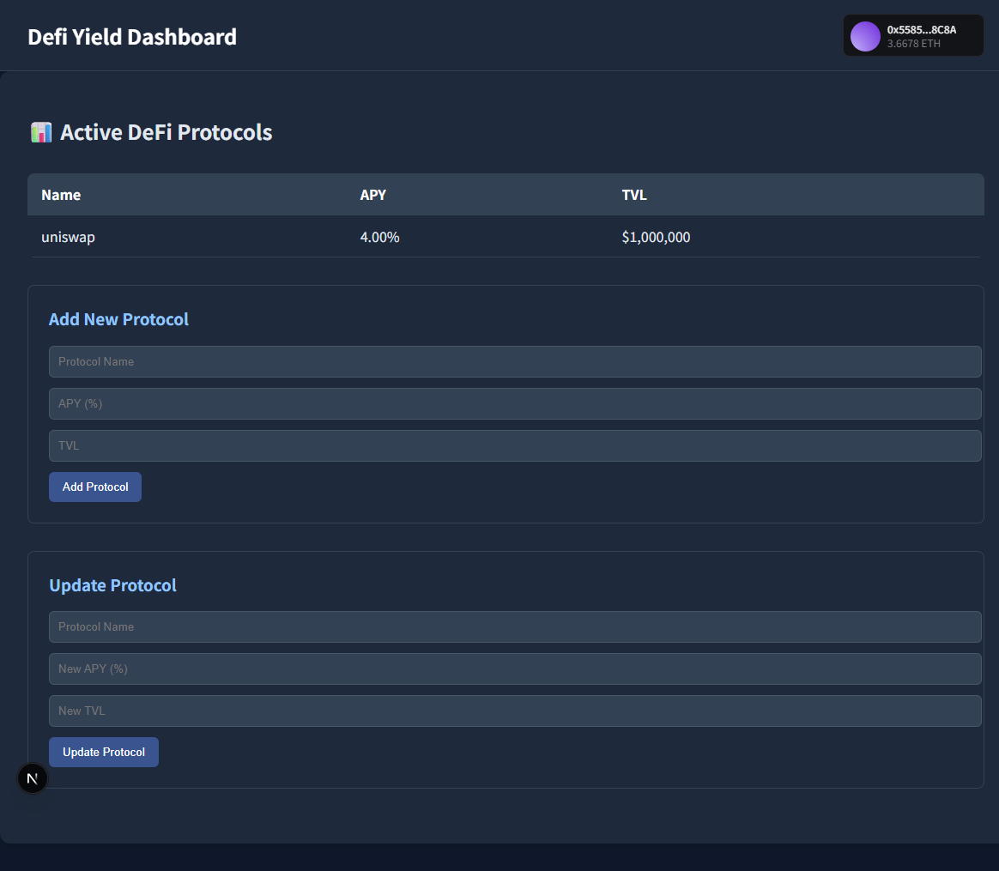

# DeFi Yield Dashboard
This project provides a simple dashboard that displays yield farming opportunities from different DeFi protocols. It consists of two main parts:

Smart Contract (Hardhat-based, deployed on Sepolia test network)
Frontend (Next.js + Thirdweb SDK)

github: https://github.com/Chujimafa/Defi-Yield-Dashboard




## Project Structure
```
root/
├── smart-contract/                 # Hardhat project for the smart contract
│   ├── contracts/
│   │   └── DeFiProtocolManager.sol
│   ├── scripts/
│   ├── test/
│   └── ...
└── frontend/                       # Frontend folder
    └── defi_yield_dashboard/       # Next.js app using Thirdweb SDK
         └──src
            ├── pages/
            ├── components/
            ├── .env
            └── ...
```


## Smart Contract Details

- **Network**: Sepolia Testnet
- **Contract Address**: [0x229D8fACf435a54bf1433A07e2a4e2d92F0bB1E5](https://sepolia.etherscan.io/address/0x229D8fACf435a54bf1433A07e2a4e2d92F0bB1E5#code)
- **Verified Contract**: [View on Etherscan](https://sepolia.etherscan.io/address/0x229D8fACf435a54bf1433A07e2a4e2d92F0bB1E5#code)

### Contract Features
- Store protocol information (Name, APY, TVL)
- Add/update protocol data
- Retrieve all protocol information

### Smart Contract Setup

1. Navigate to the smart-contract directory:  
   `cd smart-contract`

2. Install dependencies:  
   `npm install`

3. Create `.env` file with these contents:  
   `SEPOLIA_URL=https://eth-sepolia.g.alchemy.com/v2/YOUR_API_KEY`  
   `PRIVATE_KEY=YOUR_PRIVATE_KEY`

4. Compile contracts:  
   `npx hardhat compile`


## Frontend Details
- Framework: Next.js
- Integration: Thirdweb SDK

### Frontend Features
- Connects to deployed smart contract
- Displays APY and TVL data
- Simple comparison view for multiple protocols

### Frontend Setup
1. Navigate to the frontend directory:  
   `cd frontend`

2. Install dependencies:  
   `npm install`

3. Create `.env.local` file with these contents:  
   `NEXT_PUBLIC_THIRDWEB_CLIENT_ID=your_thirdweb_client_id`  

4. Run the development server:  
   `npm run dev`

5. Open [http://localhost:3000](http://localhost:3000) in your browser


